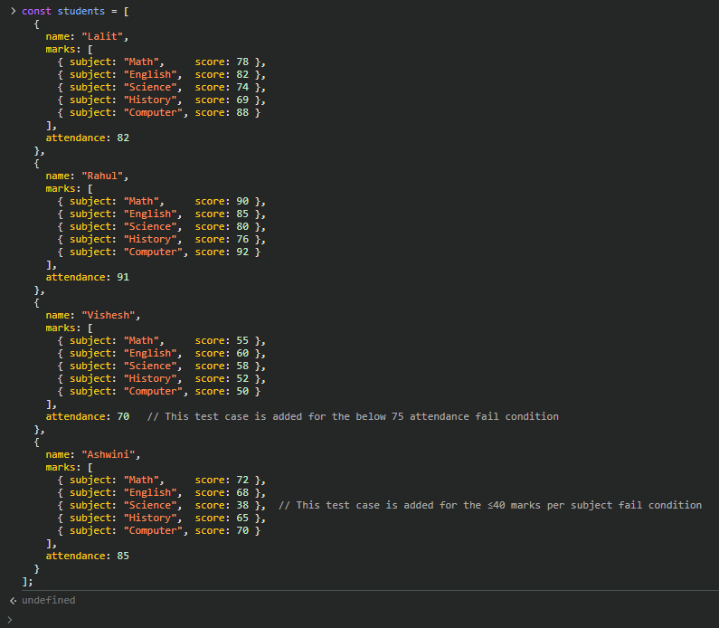
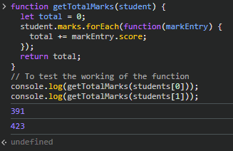
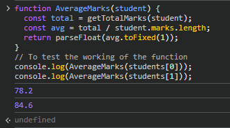
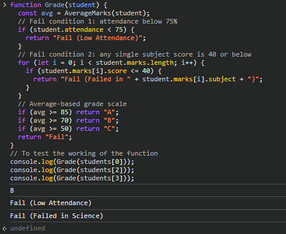
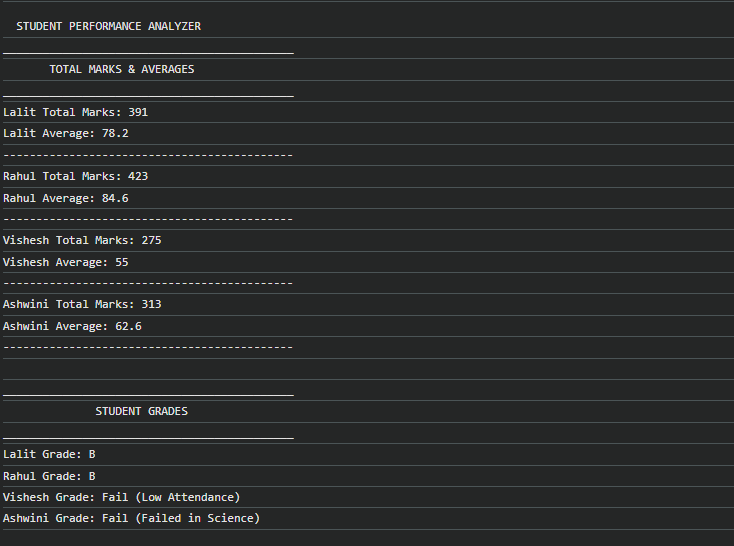
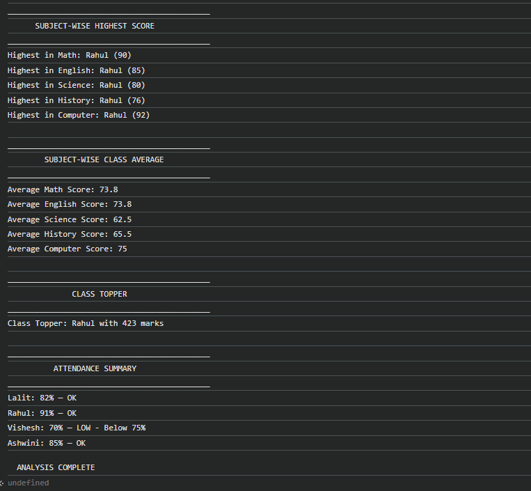

# Student Performance Analyzer — JavaScript Assignment

**Author:** Ashutosh Khadse  
**File:** `js/AshutoshKhadse_student_analyzer.js`

---

## About This Project

This is a console-based JavaScript program made to analyze student performance data.

In this program, I took a list of students, stored their marks in 5 subjects along with attendance percentage, and then performed different operations on that data. These include calculating total marks, average marks, assigning grades, finding the class topper, checking attendance status, and doing subject-wise analysis.

The main goal of this assignment was to practice core JavaScript concepts like arrays, objects, loops, functions, conditions, and console output in a proper structured way.

---

## How to Run It

### Option 1 — Browser Console (Chrome / Edge / Firefox)

1. Press `F12` to open Developer Tools  
2. Open the **Console** tab  
3. Open the JavaScript file in any text editor  
4. Copy the full code  
5. Paste it into the browser console  
6. Press `Enter`

The full output will be printed in the console.

---

## Student Data Used

I used the two students given in the assignment, **Lalit** and **Rahul**, and I added two more students so I could test both fail conditions properly.

| Student | Math | English | Science | History | Computer | Attendance | Reason |
|--------|------|---------|---------|---------|----------|------------|--------|
| Lalit | 78 | 82 | 74 | 69 | 88 | 82% | Normal pass case |
| Rahul | 90 | 85 | 80 | 76 | 92 | 91% | Highest scorer |
| Vishesh | 55 | 60 | 58 | 52 | 50 | 70% | Low attendance case |
| Ashwini | 72 | 68 | 38 | 65 | 70 | 85% | Failed in one subject |

I added **Vishesh** to check whether the program correctly fails a student when attendance is below 75%.

I added **Ashwini** to check whether the program correctly fails a student when one subject score is 40 or below.

That way, the code is not only working for the normal case, but also for important edge cases.

---

## Console Output Screenshots

### Screenshot 1 — Student Data Structure

This screenshot shows the array of student objects used in the program.

Each student object contains:
- `name`
- `marks`
- `attendance`

The `marks` part is stored as an array of objects, where each object has a `subject` and `score`.

I chose this structure because it keeps related data together. Instead of storing subject names in one array and marks in another, this way each subject stays linked with its score, which makes the logic easier to follow while looping.

---

### Screenshot 2 — Total Marks Function

This screenshot shows the `getTotalMarks()` function and the test output for Lalit and Rahul.

The function loops through a student's marks and adds all subject scores into one total.

I used `forEach()` here because I only needed to visit each mark and add the score. There was no need for index handling, so `forEach()` felt cleaner than writing a manual loop.

The output is:

- Lalit = `391`
- Rahul = `423`

Which is correct:

- Lalit → 78 + 82 + 74 + 69 + 88 = **391**
- Rahul → 90 + 85 + 80 + 76 + 92 = **423**

---

### Screenshot 3 — Average Marks Function

This screenshot shows the `AverageMarks()` function and its output.

Instead of summing marks again inside this function, I reused `getTotalMarks()`. After getting the total, I divided it by the number of subjects.

I used `toFixed(1)` so the average always shows one decimal place, which looks cleaner in the output.

The output is:

- Lalit = `78.2`
- Rahul = `84.6`

Calculations:

- Lalit → 391 ÷ 5 = **78.2**
- Rahul → 423 ÷ 5 = **84.6**

I also used `parseFloat()` because `toFixed()` returns a string, and I wanted the result as a number.

---

### Screenshot 4 — Grade Function with Fail Conditions

This screenshot shows the `Grade()` function and some test cases.

This function was the most important one logically because the order of checks matters.

I handled it in this order:

1. First, I check attendance  
   If attendance is below 75, the student immediately gets:  
   `Fail (Low Attendance)`

2. Then, I check subject scores  
   If any subject is 40 or below, the student gets:  
   `Fail (Failed in SubjectName)`

3. Only if both checks pass, I calculate grade from average:
   - 85 and above → A
   - 70 and above → B
   - 50 and above → C

This order is important. For example, Vishesh has an average that could still fall into a passing grade, but because attendance is below 75, the correct final result should be fail.

Same with Ashwini, even if overall average is not terrible, one subject score is 38, so the result should still be fail.

Test output shown:
- Lalit → `B`
- Vishesh → `Fail (Low Attendance)`
- Ashwini → `Fail (Failed in Science)`

---

### Screenshot 5 — Full Program Output: Totals, Averages and Grades

This screenshot shows the first full part of the program output.

It includes:
- program heading
- total marks and averages for all students
- assigned grades for all students

Here I used separate display functions so the code stays organized. Instead of mixing calculation logic and printing everywhere, I kept the calculation in one place and the output formatting in another place.

This part clearly shows both normal and fail cases:

- Lalit → total 391, average 78.2, grade B  
- Rahul → total 423, average 84.6, grade B  
- Vishesh → failed due to attendance  
- Ashwini → failed due to Science score

Rahul is very close to grade A, but since the rule says 85 and above, his 84.6 still stays in grade B.

---

### Screenshot 6 — Subject Analysis, Class Topper and Attendance Summary

This screenshot shows the remaining analysis done by the program.

It includes:
- subject-wise highest score
- subject-wise class average
- class topper
- attendance summary

#### Subject-wise Highest Score
For this part, I used nested loops.

The outer loop goes subject by subject, and the inner loop compares all students for that same subject index. This way I can find who scored the highest in each subject.

Rahul had the highest marks in all five subjects in this dataset.

#### Subject-wise Class Average
Here also I used nested loops.

For each subject, I added marks of all students and divided by the total number of students. I again used `toFixed(1)` for neat output.

#### Class Topper
To find the topper, I used a loop and kept track of the highest total seen so far.

Whenever a student’s total was greater than the current highest, I updated the topper details.

I did not sort the whole array because it was unnecessary when I only needed one maximum.

#### Attendance Summary
In this part, I displayed each student’s attendance along with a status label.

I used a ternary operator here:
- `OK` if attendance is 75 or above
- `LOW - Below 75%` if attendance is below 75

This also makes it easy to visually connect Vishesh’s low attendance with the reason he failed earlier.

---

## Functions Used in the Program

| Function | Purpose |
|---------|---------|
| `getTotalMarks(student)` | Calculates total marks of one student |
| `AverageMarks(student)` | Calculates average marks up to one decimal place |
| `Grade(student)` | Checks fail conditions first, then assigns grade |
| `displayTotalsAndAverages()` | Prints total and average for every student |
| `displayGrades()` | Prints final grade/result for every student |
| `displaySubjectHighest()` | Finds highest scorer in each subject |
| `displaySubjectAverages()` | Finds class average for each subject |
| `displayClassTopper()` | Finds the student with the highest total |
| `displayAttendanceSummary()` | Prints attendance percentage and status |

---

## JavaScript Concepts Used

| Concept | How I Used It |
|--------|----------------|
| Arrays | Used for student list and marks list |
| Objects | Used to store each student and each subject-score pair |
| `forEach()` | Used where I only needed to visit every item |
| `for` loop | Used where index-based comparison was needed |
| Functions | Used to divide logic into smaller reusable parts |
| `if/else` | Used in grade conditions and fail checks |
| Ternary operator | Used in attendance summary |
| `console.log()` | Used for all program output |

---

## Final Note

This assignment helped me practice how to work with nested arrays and objects in JavaScript and how to break a program into smaller reusable functions.

I also got to think more carefully about the grade logic, especially the fail conditions, because the order of checking changes the final result.

Overall, this was a good exercise for building logic in plain JavaScript without using HTML or the DOM.