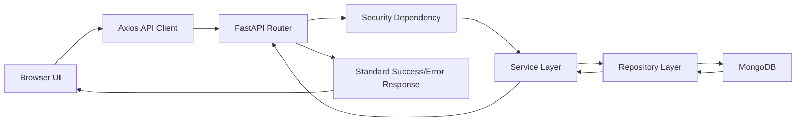
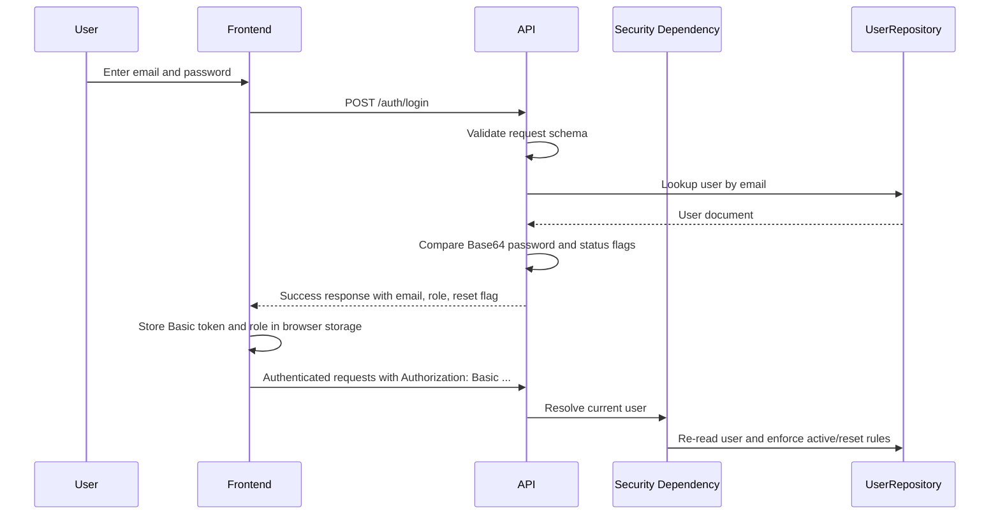

# Architecture Document

## Table of Contents
- [Overall Architecture](#overall-architecture)
- [Backend Layered Architecture](#backend-layered-architecture)
- [Frontend Architecture](#frontend-architecture)
- [Request Lifecycle](#request-lifecycle)
- [Authentication Flow](#authentication-flow)
- [Role-Based Access](#role-based-access)
- [Validation Strategy](#validation-strategy)
- [Error Handling](#error-handling)
- [Logging](#logging)
- [Folder Structure](#folder-structure)
- [Design Decisions](#design-decisions)

## Overall Architecture
The application is a two-tier web system:
- React frontend for interaction and navigation
- FastAPI backend for business logic and data access
- MongoDB for persistence

The frontend communicates with the backend through HTTP requests using Axios. The backend exposes versioned REST endpoints under `/api/v1` and public authentication routes under `/auth`.

## Backend Layered Architecture
The backend follows a layered structure:
- Router: HTTP endpoint definitions and access control
- Service: Business rules and orchestration
- Repository: MongoDB read/write operations

This keeps route handlers thin and makes validation, authorization, and persistence logic easier to test separately.

## Frontend Architecture
The frontend is structured around:
- Route-level page components
- Shared layout components
- Feature-specific form and list components
- Service modules for API calls
- Session helpers for Basic Auth state

Route guards are implemented in the browser for usability, but server-side authorization remains the final enforcement layer.

## Request Lifecycle


## Authentication Flow


## Role-Based Access
Allowed roles are defined by the backend enum:
- `ADMIN`
- `HR`
- `INTERVIEWER`

The backend applies access checks with `require_role(...)` on protected routes. The frontend mirrors these rules with route guards for navigation, but the backend remains authoritative.

## Validation Strategy
Validation is enforced at multiple levels:
- Pydantic request models validate request bodies
- Custom field validators normalize and constrain values
- Repository methods validate MongoDB identifiers before querying
- Service methods apply business validation, such as uniqueness, status constraints, and scheduling conflicts

Validation examples already implemented:
- Email domain restrictions
- Password length and allowed characters
- Numeric mobile number length
- Candidate and job text rules
- Interview time in `HH:MM`
- Rating range from 1 to 5

## Error Handling
The application uses custom exception classes and centralized exception handlers.

Observed response pattern:
- Success responses return a standard envelope with `success`, `message`, `data`, and optional `meta`
- Error responses return structured status and error metadata

This gives the frontend a predictable contract for both validation and operational failures.

## Logging
Logging is configured in `src/core/logger.py`:
- Logs are written to stdout
- Logs are also written to `application.log`

Startup and shutdown events are logged in the FastAPI lifespan hook. Repositories also log repository-level failures and operational events.

## Folder Structure
```text
backend/src/
  core/         application settings, MongoDB connection, seed, logging
  constants/    shared validation and workflow constants
  enums/        business enums for roles, candidate status, recommendations
  exceptions/   custom exceptions and handlers
  repositories/ database access
  routers/      HTTP endpoints
  schemas/      request and response DTOs
  services/     business logic
  utils/        auth, dependency helpers, validation helpers

frontend/src/
  components/   shared UI and feature components
  constants/    roles, routes, API constants, sidebar config
  pages/        screen-level views
  services/     Axios-based API modules
  styles/       feature-specific CSS
  utils/        session and feature helpers
```

## Design Decisions
- HTTP Basic auth was used because the project implements a simple enterprise-style credential flow and the frontend stores the encoded credential string for authenticated requests.
- MongoDB documents are normalized across multiple collections instead of forcing a single monolithic collection.
- Candidate resumes are stored separately from candidate profiles so binary payloads do not bloat the main candidate document.
- Candidate status changes are written to a dedicated history collection for auditability.
- Interview feedback is embedded on the interview document to keep the interview-feedback relationship simple and query-friendly.
- Dashboard endpoints aggregate data from existing collections rather than duplicating counters.
