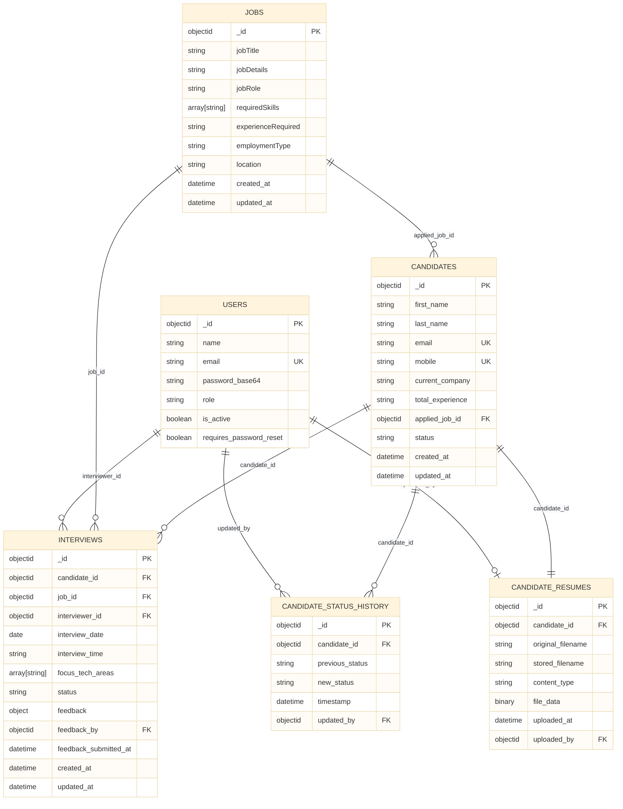

# Database Design

## Table of Contents
- [Database Overview](#database-overview)
- [Logical ERD](#logical-erd)
- [User Collection](#user-collection)
- [Job Collection](#job-collection)
- [Candidate Collection](#candidate-collection)
- [Interview Collection](#interview-collection)
- [Feedback Model](#feedback-model)
- [CandidateStatusHistory Collection](#candidatestatushistory-collection)
- [Index Recommendations](#index-recommendations)

## Database Overview
The application uses MongoDB with the following logical collections:
- `users`
- `jobs`
- `candidates`
- `interviews`
- `candidate_resumes`
- `candidate_status_history`

Feedback is stored as an embedded document on the `interviews` collection rather than a separate collection.

## Logical ERD

## User Collection
### Purpose
Stores application accounts and role information.

### Fields
| Field | Data Type | Validation / Notes |
|---|---|---|
| `_id` | `ObjectId` | MongoDB generated identifier |
| `name` | `string` | Required, 2-100 chars, alphabets and spaces only |
| `email` | `string` | Required, company email format |
| `password_base64` | `string` | Base64-encoded password string |
| `role` | `string` | `ADMIN`, `HR`, or `INTERVIEWER` |
| `is_active` | `boolean` | Controls access |
| `requires_password_reset` | `boolean` | Blocks protected access until reset |

### ObjectId References
- No direct outbound references from the user document are enforced in code.

### Relationships
- One user can act as interviewer in many interviews.
- One user can be referenced as `updated_by` in candidate status history.
- One user can be referenced as `uploaded_by` in resume metadata.

### Index Recommendations
- Unique index on `email`
- Index on `role`
- Index on `is_active`

## Job Collection
### Purpose
Stores job descriptions used for candidate application and interview planning.

### Fields
| Field | Data Type | Validation / Notes |
|---|---|---|
| `_id` | `ObjectId` | MongoDB generated identifier |
| `jobTitle` | `string` | Required, 3-100 chars |
| `jobDetails` | `string` | Required, 20-1000 chars |
| `jobRole` | `string` | Required, 2-60 chars |
| `requiredSkills` | `array[string]` | Required, unique skill values, max 20 |
| `experienceRequired` | `string` | Required canonical experience format |
| `employmentType` | `string` | `Full Time` or `Internship` |
| `location` | `string` | Required, 2-80 chars |
| `updated_at` | `datetime` | Updated on modification |

### ObjectId References
- Referenced by `candidates.applied_job_id`
- Referenced by `interviews.job_id`

### Relationships
- One job can have many candidates applied to it.
- One job can be used in many interviews.

### Index Recommendations
- Index on `jobTitle`
- Index on `jobRole`
- Index on `location`

## Candidate Collection
### Purpose
Stores candidate profile data.

### Fields
| Field | Data Type | Validation / Notes |
|---|---|---|
| `_id` | `ObjectId` | MongoDB generated identifier |
| `first_name` | `string` | Required, 2-50 chars |
| `last_name` | `string` | Required, 2-50 chars |
| `email` | `string` | Required, unique, personal email domain only |
| `mobile` | `string` | Required, 10 digits |
| `current_company` | `string` | Required, up to 120 chars |
| `total_experience` | `string` | Required canonical experience format |
| `applied_job_id` | `ObjectId` or `string` | Must resolve to a job document |
| `status` | `string` | Defaults to `PROFILE_CREATED` |
| `created_at` | `datetime` | Auto-generated |
| `updated_at` | `datetime` | Auto-generated |
| `applied_job` | `object` | Denormalized summary returned by API, not the primary field source |

### ObjectId References
- `applied_job_id` -> `jobs._id`

### Relationships
- One candidate can have one resume metadata record.
- One candidate can have many status history records.
- One candidate can have multiple interviews over time in the broader workflow, although the application enforces scheduling rules to avoid duplicate active interview slots.

### Index Recommendations
- Unique index on `email`
- Unique index on `mobile`
- Index on `(first_name, last_name)`
- Index on `current_company`
- Index on `applied_job_id`

## Interview Collection
### Purpose
Stores interview schedules and embedded feedback.

### Fields
| Field | Data Type | Validation / Notes |
|---|---|---|
| `_id` | `ObjectId` | MongoDB generated identifier |
| `candidate_id` | `ObjectId` or `string` | References candidate |
| `job_id` | `ObjectId` or `string` | References job |
| `interviewer_id` | `ObjectId` or `string` | References user with `INTERVIEWER` role |
| `interview_date` | `date` or `datetime` | Stored as BSON-safe UTC datetime |
| `interview_time` | `string` | `HH:MM` 24-hour format |
| `focus_tech_areas` | `array[string]` | Required, deduplicated |
| `status` | `string` | Scheduling state, e.g. `INTERVIEW_SCHEDULED` or `INTERVIEW_COMPLETED` |
| `feedback` | `object` | Embedded feedback document |
| `feedback_by` | `ObjectId` or `string` | User who submitted feedback |
| `feedback_submitted_at` | `datetime` | Auto-generated when feedback is stored |
| `created_at` | `datetime` | Auto-generated |
| `updated_at` | `datetime` | Auto-generated |

### ObjectId References
- `candidate_id` -> `candidates._id`
- `job_id` -> `jobs._id`
- `interviewer_id` -> `users._id`
- `feedback_by` -> `users._id`

### Relationships
- One interview belongs to one candidate, one job, and one interviewer.
- Feedback is embedded in the interview document.

### Index Recommendations
- Index on `candidate_id`
- Index on `job_id`
- Index on `interviewer_id`
- Compound index on `(status, interview_date, interview_time)`
- Index on `created_at`

## Feedback Model
### Purpose
Represents the evaluation submitted for an interview.

### Fields
| Field | Data Type | Validation / Notes |
|---|---|---|
| `technical_rating` | `integer` | 1-5 |
| `communication_rating` | `integer` | 1-5 |
| `problem_solving` | `integer` | 1-5 |
| `tech_areas_covered` | `array[string]` | Required, deduplicated |
| `comments` | `string` | Optional |
| `recommendation` | `string` | `NEXT_ROUND`, `SELECT`, or `REJECT` |

### Storage Location
Embedded inside `interviews.feedback`

## Candidate Resume Collection
### Purpose
Stores uploaded resume bytes and metadata separately from the candidate profile.

### Fields
| Field | Data Type | Validation / Notes |
|---|---|---|
| `_id` | `ObjectId` | MongoDB generated identifier |
| `candidate_id` | `ObjectId` | Unique per candidate |
| `original_filename` | `string` | Original uploaded file name |
| `stored_filename` | `string` | Internal stored file name |
| `content_type` | `string` | MIME type |
| `file_data` | `binary` | Resume content |
| `uploaded_at` | `datetime` | Auto-generated |
| `uploaded_by` | `ObjectId` or `string` | User who uploaded the resume |

### ObjectId References
- `candidate_id` -> `candidates._id`
- `uploaded_by` -> `users._id`

### Relationships
- One candidate can have at most one resume record.

### Index Recommendations
- Unique index on `candidate_id`
- Index on `uploaded_at`

## CandidateStatusHistory Collection
### Purpose
Stores immutable audit entries for candidate status changes.

### Fields
| Field | Data Type | Validation / Notes |
|---|---|---|
| `_id` | `ObjectId` | MongoDB generated identifier |
| `candidate_id` | `ObjectId` | References candidate |
| `previous_status` | `string` | Optional prior status |
| `new_status` | `string` | Required candidate status |
| `timestamp` | `datetime` | Auto-generated |
| `updated_by` | `ObjectId` or `string` | References user who made the change |

### ObjectId References
- `candidate_id` -> `candidates._id`
- `updated_by` -> `users._id`

### Relationships
- One candidate can have many status history entries.

### Index Recommendations
- Compound index on `(candidate_id, timestamp desc)`
- Index on `new_status`

## Index Recommendations
The repositories already attempt the following indexes:
- `users.email` unique
- `users.role`
- `jobs.jobTitle`
- `candidates.email` unique
- `candidates.mobile` unique
- `candidates.first_name + candidates.last_name`
- `candidates.current_company`
- `candidates.applied_job_id`
- `candidate_resumes.candidate_id` unique
- `candidate_status_history.candidate_id + timestamp`
- `interviews.candidate_id`
- `interviews.job_id`
- `interviews.interviewer_id`
- `interviews.created_at`
