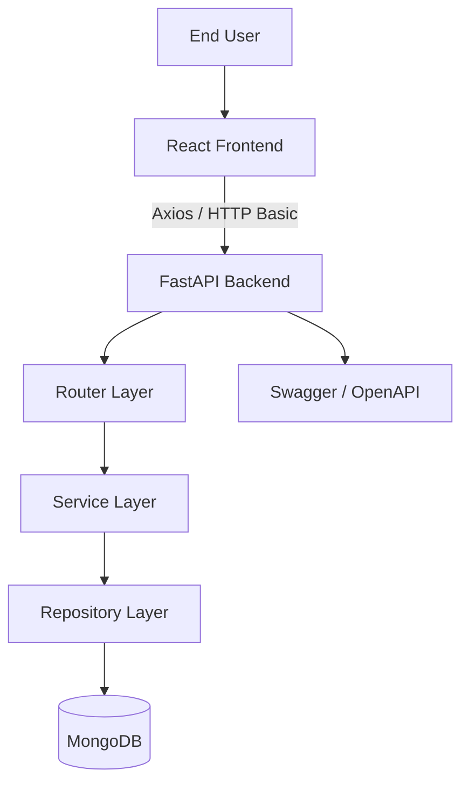
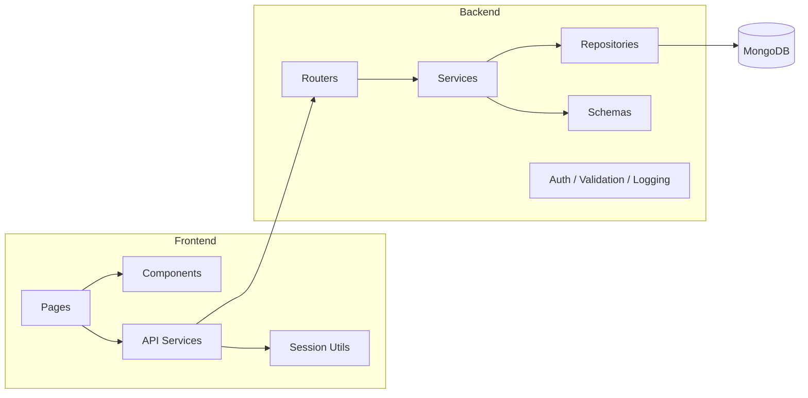
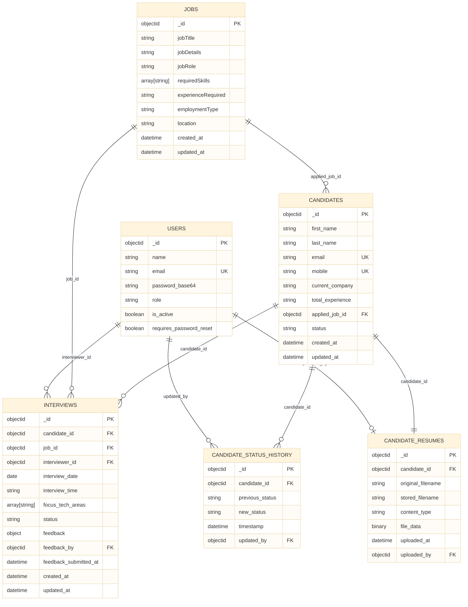
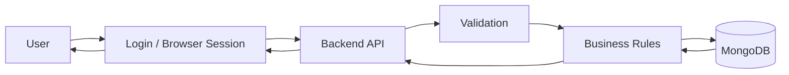
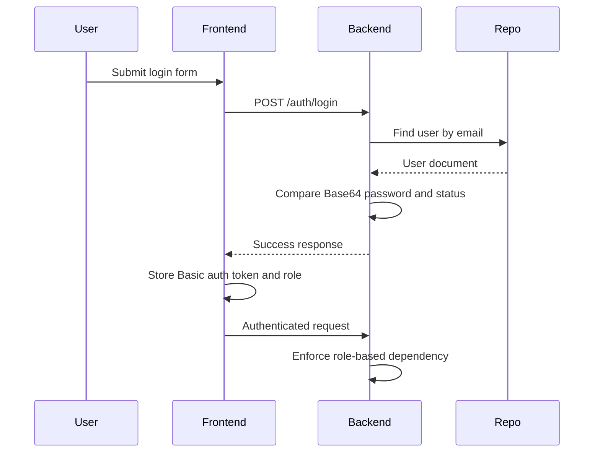
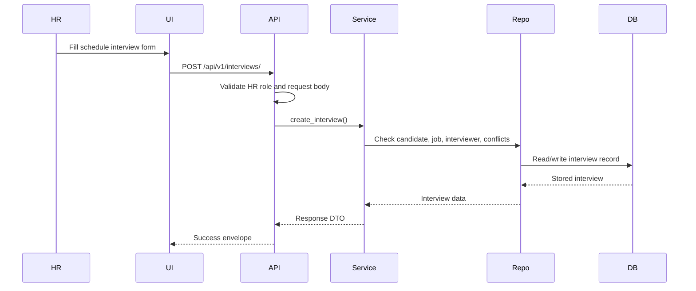
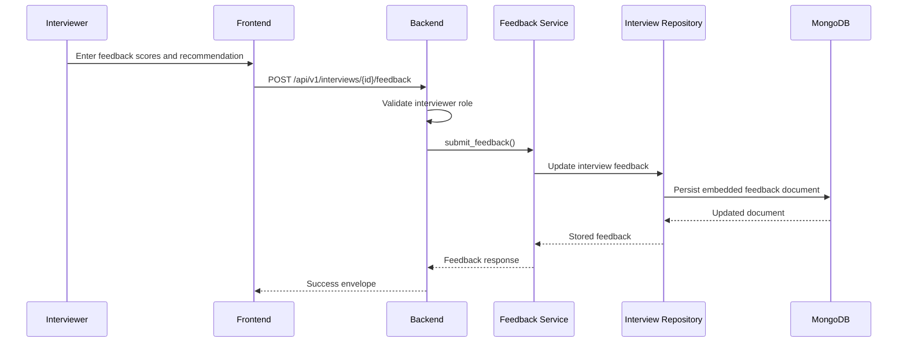
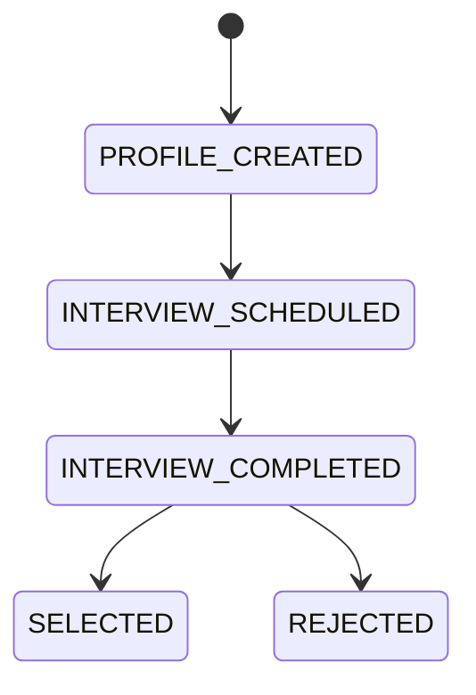
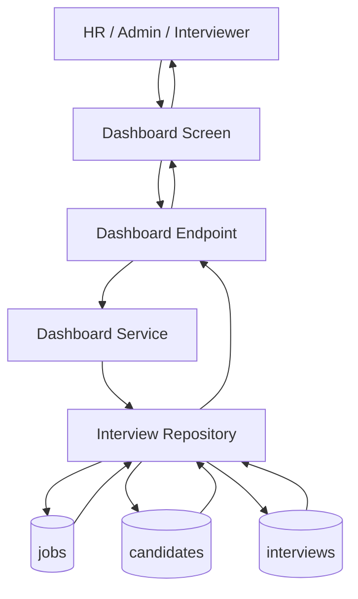

# Diagrams

## Table of Contents
- [System Architecture Diagram](#system-architecture-diagram)
- [High-Level Component Diagram](#high-level-component-diagram)
- [Logical ER Diagram](#logical-er-diagram)
- [Data Flow Diagram](#data-flow-diagram)
- [Authentication Flow Diagram](#authentication-flow-diagram)
- [Schedule Interview Sequence Diagram](#schedule-interview-sequence-diagram)
- [Submit Feedback Sequence Diagram](#submit-feedback-sequence-diagram)
- [Candidate Lifecycle Diagram](#candidate-lifecycle-diagram)
- [Dashboard Data Flow Diagram](#dashboard-data-flow-diagram)
- [Folder Structure Diagram](#folder-structure-diagram)

## System Architecture Diagram


## High-Level Component Diagram


## Logical ER Diagram


## Data Flow Diagram


## Authentication Flow Diagram


## Schedule Interview Sequence Diagram


## Submit Feedback Sequence Diagram


## Candidate Lifecycle Diagram


## Dashboard Data Flow Diagram


## Folder Structure Diagram
```mermaid
flowchart TB
    ROOT[Capstone_InterviewManagementPortal]
    ROOT --> BE[backend]
    ROOT --> FE[frontend]
    ROOT --> DOCS[docs]

    BE --> BE_SRC[src]
    BE --> BE_TESTS[tests]
    BE --> BE_POSTMAN[postman]
    BE --> BE_LOGS[logs]

    BE_SRC --> BE_CORE[core]
    BE_SRC --> BE_ROUTERS[routers]
    BE_SRC --> BE_SERVICES[services]
    BE_SRC --> BE_REPOS[repositories]
    BE_SRC --> BE_SCHEMAS[schemas]
    BE_SRC --> BE_UTILS[utils]
    BE_SRC --> BE_CONSTANTS[constants]
    BE_SRC --> BE_ENUMS[enums]

    FE --> FE_SRC[src]
    FE_SRC --> FE_COMPONENTS[components]
    FE_SRC --> FE_PAGES[pages]
    FE_SRC --> FE_SERVICES[services]
    FE_SRC --> FE_UTILS[utils]
    FE_SRC --> FE_CONSTANTS[constants]
    FE_SRC --> FE_STYLES[styles]
