# Interview Management Portal

## Table of Contents
- [Overview](#overview)
- [Features](#features)
- [Technology Stack](#technology-stack)
- [Folder Structure](#folder-structure)
- [Installation](#installation)
- [Environment Variables](#environment-variables)
- [Run Frontend](#run-frontend)
- [Run Backend](#run-backend)
- [Run Tests](#run-tests)
- [Swagger URL](#swagger-url)
- [Postman Collection](#postman-collection)
- [Screenshots](#screenshots)
- [Future Improvements](#future-improvements)

## Overview
The Interview Management Portal is a React and FastAPI-based capstone project for managing users, jobs, candidates, interview schedules, feedback, and dashboard metrics.

The backend uses a layered architecture:
- Router
- Service
- Repository

MongoDB is used for persistence. Authentication is implemented with HTTP Basic auth, and access control is enforced with role-based route restrictions.

## Features
- Basic authentication with login, password reset, and logout
- Role-based access control for `ADMIN`, `HR`, and `INTERVIEWER`
- User management for admin users
- Job description management
- Candidate profile management
- Resume upload and retrieval
- Candidate status history tracking
- Interview scheduling and updates
- Interviewer-assigned interview views
- Feedback submission and viewing
- HR, Admin, and Interviewer dashboards
- Swagger/OpenAPI documentation
- Pytest-based test suite
- Postman collection for API testing

## Technology Stack
- Frontend: React, Vite, React Router, Axios
- Backend: FastAPI, Uvicorn, Pydantic, Motor
- Database: MongoDB
- Testing: Pytest, Pytest-Asyncio, Pytest-Cov

## Folder Structure
```text
Capstone_InterviewManagementPortal/
  backend/
    src/
      core/
      constants/
      enums/
      exceptions/
      repositories/
      routers/
      schemas/
      services/
      utils/
    tests/
    postman/
    logs/
  frontend/
    src/
      components/
      constants/
      hooks/
      pages/
      services/
      styles/
      utils/
```

## Installation
1. Install Python and Node.js.
2. Start MongoDB locally or provide a remote MongoDB URI.
3. Configure backend `.env`.
4. Configure frontend `.env`.
5. Install backend dependencies with `pip install -r requirements.txt`.
6. Install frontend dependencies with `npm install`.

## Environment Variables
### Backend
Defined in `backend/.env`:
- `PROJECT_NAME`
- `API_V1_STR`
- `MONGODB_URL`
- `DATABASE_NAME`
- `ENVIRONMENT`
- `LOG_LEVEL`
- `DEFAULT_ADMIN_PASSWORD`
- `DEFAULT_USER_PASSWORD`

### Frontend
Defined in `frontend/.env`:
- `VITE_API_URL`

## Run Frontend
```bash
cd frontend
npm run dev
```

Default Vite URL:
- `http://localhost:5173`

## Run Backend
```bash
cd backend
python -m uvicorn src.main:app --reload --port 8000
```

## Run Tests
```bash
cd backend
python -m pytest
```

## Swagger URL
- Local Swagger UI: `http://localhost:8000/docs`

## Postman Collection
Location:
- `backend/postman/InterviewManagementPortal.postman_collection.json`

## Screenshots

Add the final capstone screenshots here:

### Login Page

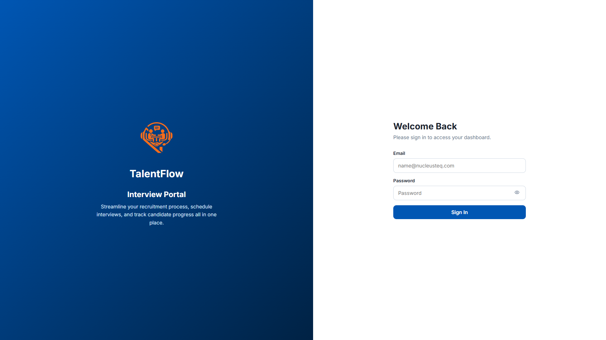

### Dashboards

#### HR Dashboard

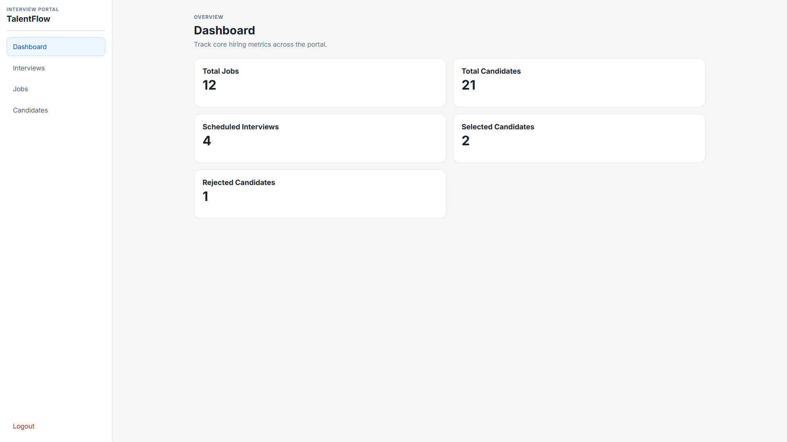

#### Admin Dashboard

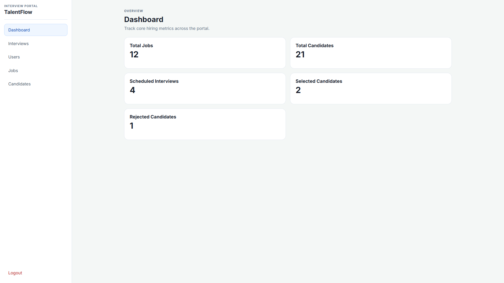

#### Interviewer Dashboard

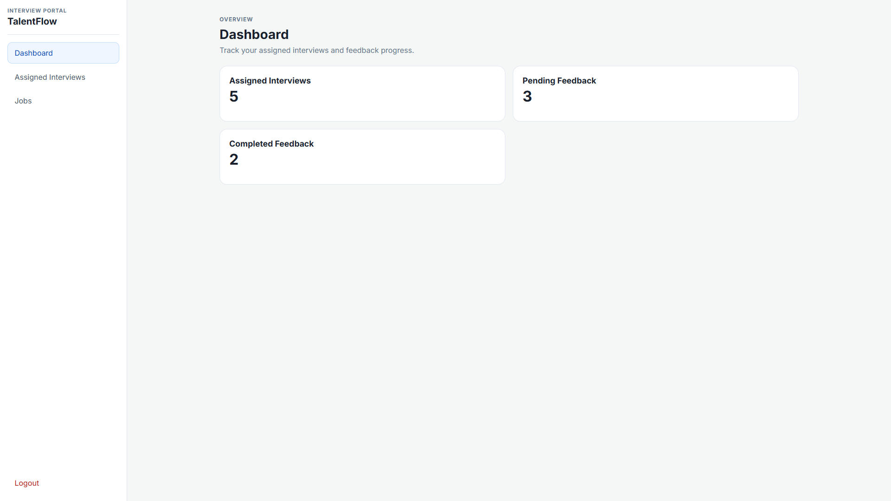

### User Management

#### User List Screen

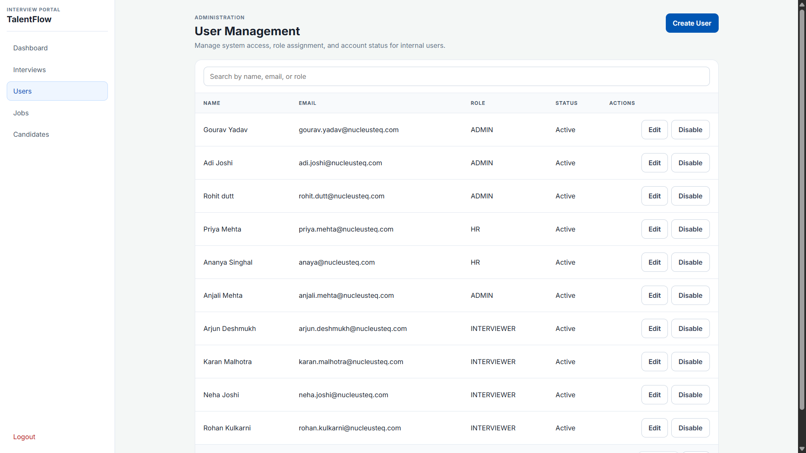

#### Create User Screen

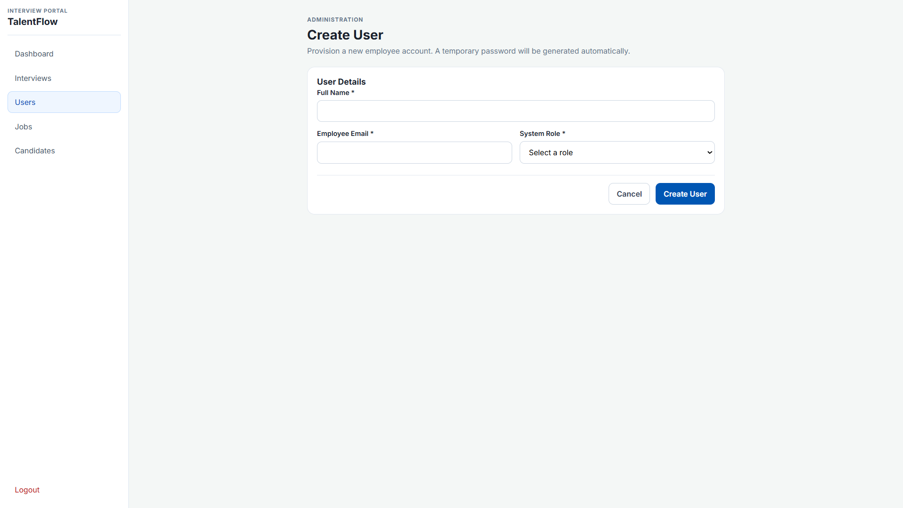

#### Edit User Screen

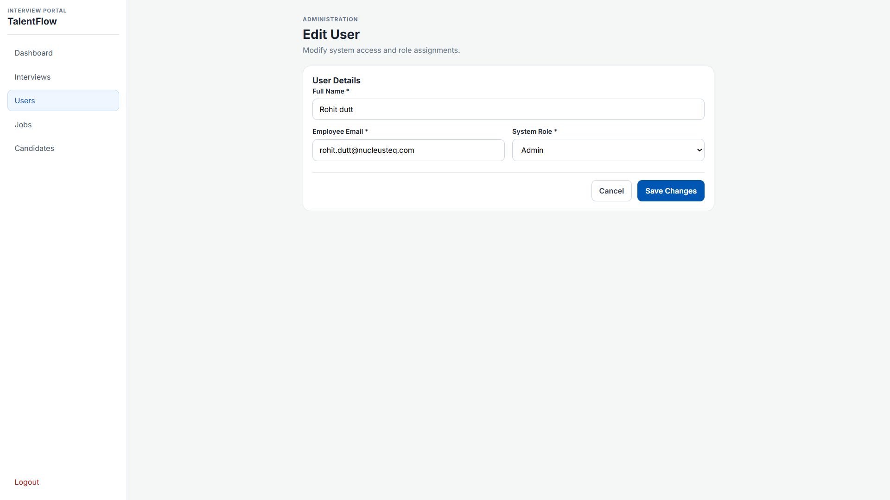

### Job Management

#### Job List Screen

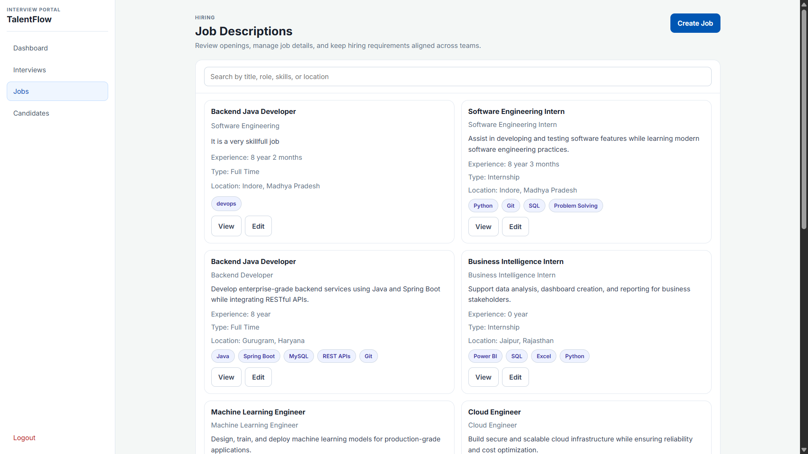

#### Create Job Screen

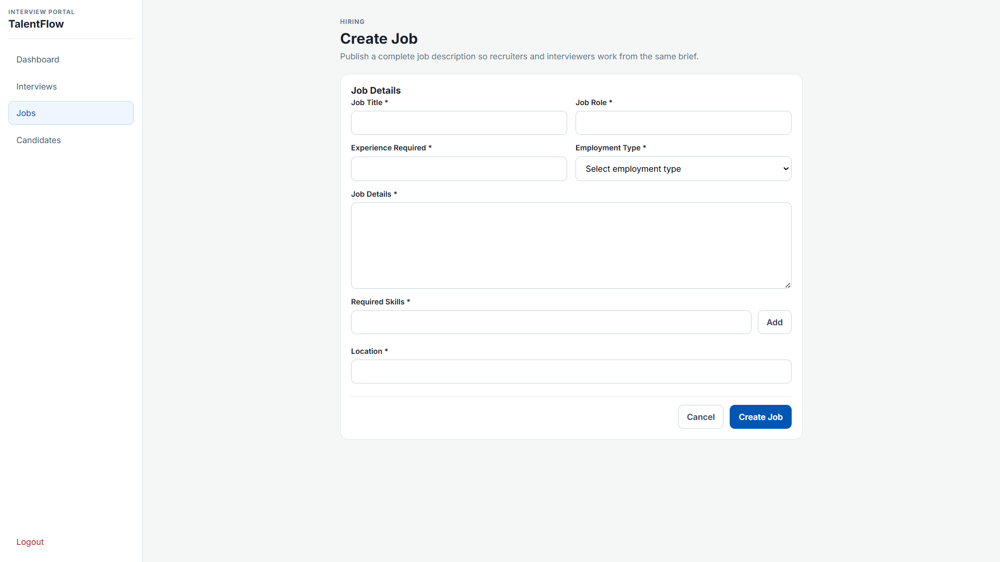

#### Edit Job Screen

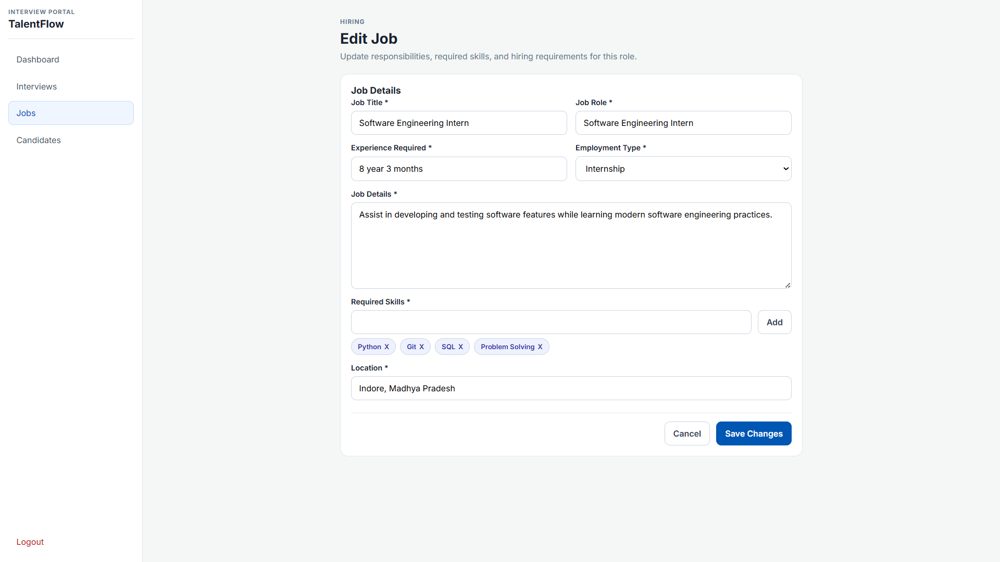

### Candidate Management

#### Candidate List Screen

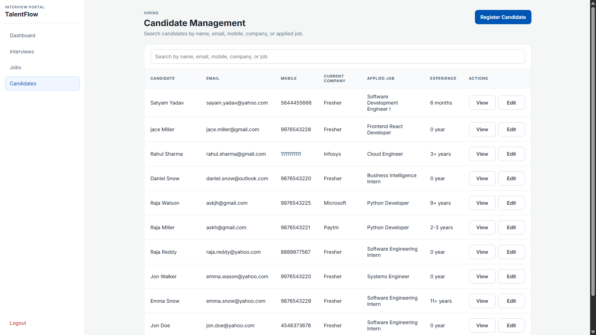

#### Create Candidate Screen

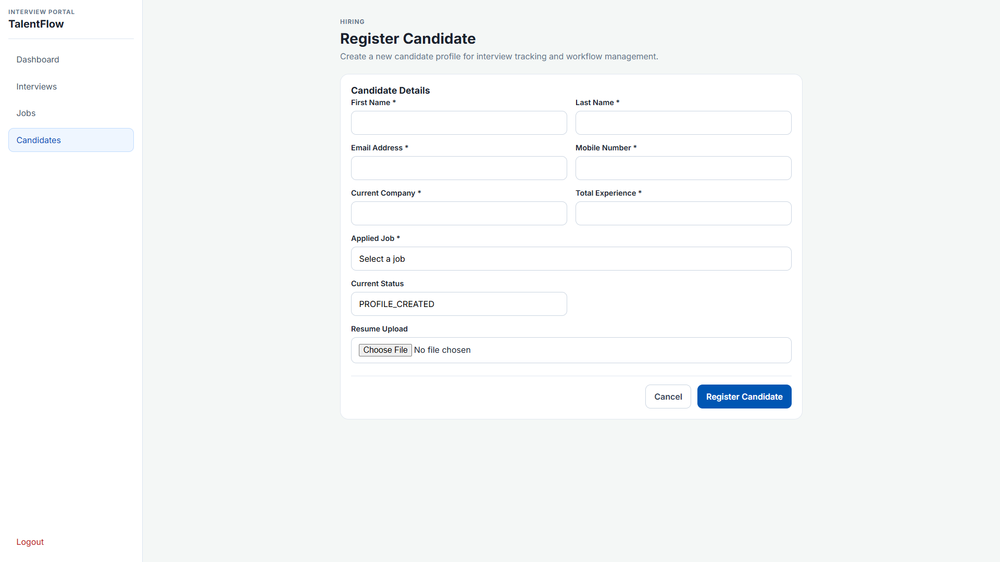

#### Edit Candidate Screen

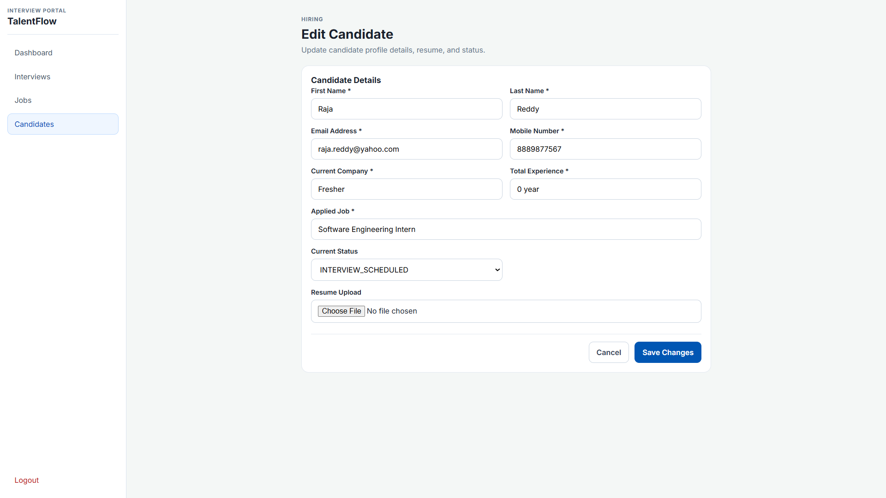

### Interview Management

#### Interview List Screen

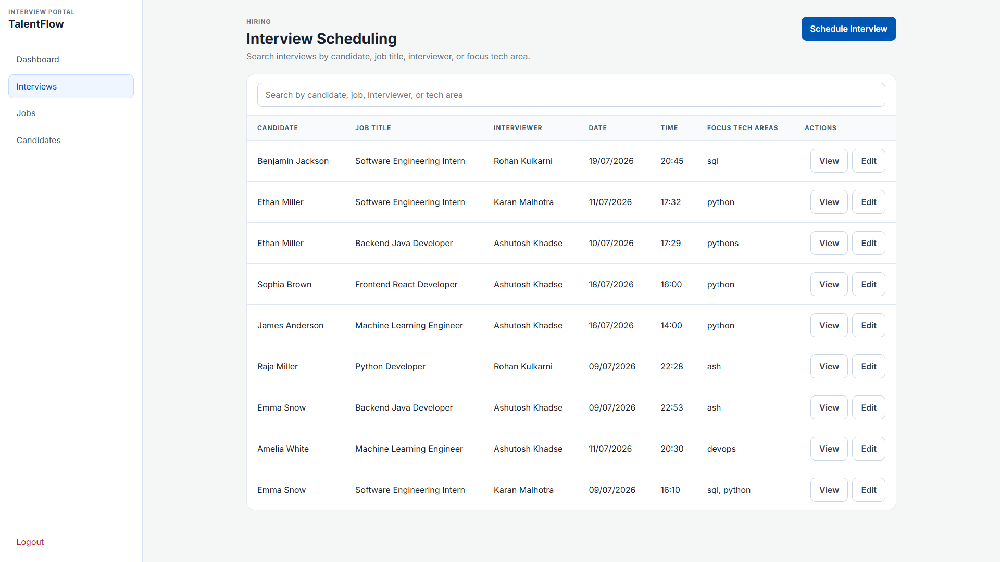

#### Schedule Interview Screen

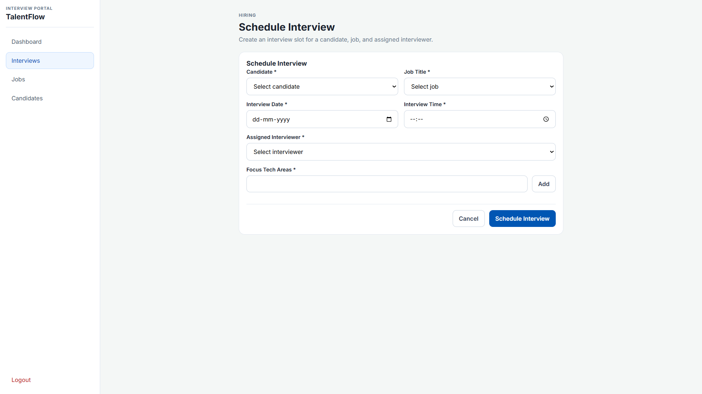

#### Edit Interview Screen

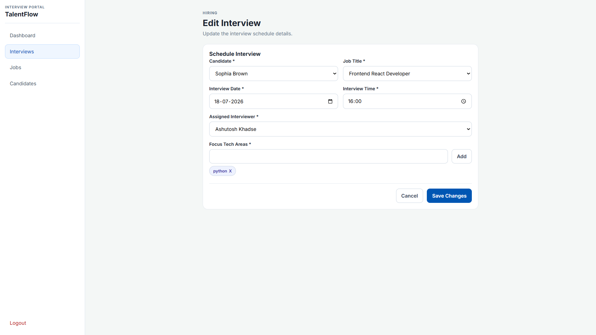

### Feedback Management

#### Feedback Submission Screen

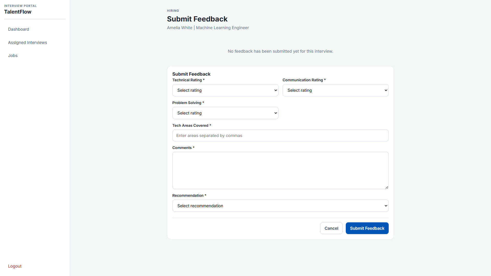

## Future Improvements
- Replace HTTP Basic auth with token-based authentication
- Add refresh-token support and session expiration
- Add database migration or schema bootstrap scripts
- Add file storage for resumes outside MongoDB if payload size grows
- Add audit logs for all write operations
- Add automated frontend tests
- Add deployment manifests for Docker/Kubernetes
