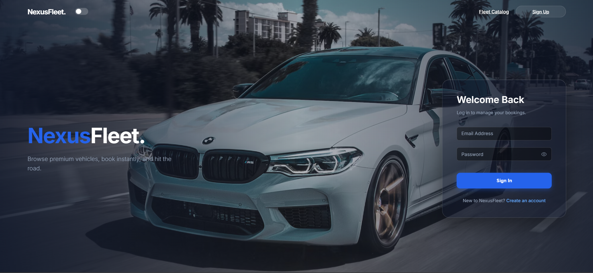
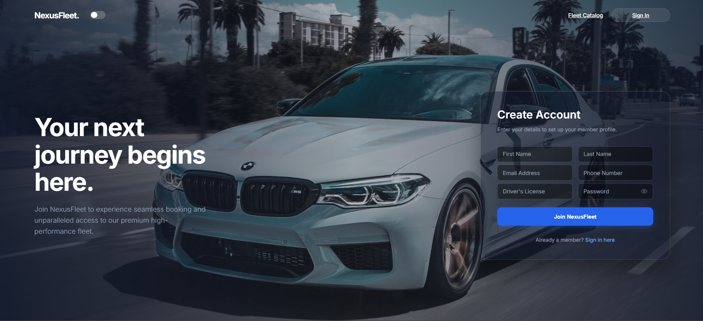
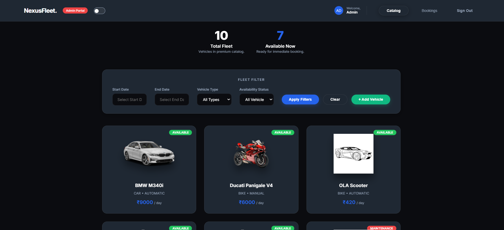
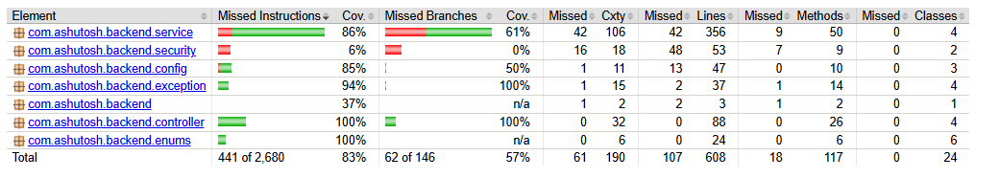

# Vehicle Rental System

Full-stack capstone project for browsing rental vehicles, creating bookings, managing inventory, and collecting post-trip reviews.

The project is split into three parts:

- `backend/vehicle-rental-system`: Spring Boot REST API with JWT authentication and PostgreSQL persistence
- `frontend/`: static HTML, CSS, and JavaScript dashboard and auth pages
- `db/`: SQL schema, database design notes, and ERD assets

## Project Scope

This codebase covers the complete rental workflow:

- user registration and login
- JWT-based session handling
- public vehicle catalog and filtering
- admin inventory management
- booking creation, cancellation, and lifecycle tracking
- review submission and deletion
- PostgreSQL-backed persistence with schema validation

## Repository Layout

```text
Capstone_VehicleRentalSystem/
|-- architecture.md
|-- README.md
|-- backend/
|   `-- vehicle-rental-system/
|       |-- pom.xml
|       |-- src/main/java/com/ashutosh/backend/
|       |   |-- config/
|       |   |-- controller/
|       |   |-- dto/
|       |   |-- entity/
|       |   |-- enums/
|       |   |-- exception/
|       |   |-- repository/
|       |   |-- security/
|       |   `-- service/
|       |-- src/main/resources/application.properties
|       `-- src/test/java/com/ashutosh/backend/
|-- db/
|   |-- vehicle_rental_schema.sql
|   |-- vehicle_rental_schema.md
|   `-- erd/erd.png
`-- frontend/
    |-- index.html
    |-- register.html
    |-- dashboard.html
    |-- css/
    `-- js/
        |-- api.js
        |-- auth.js
        |-- dashboard.js
        `-- utils.js
```

## Technology Stack

| Layer | Technology |
| --- | --- |
| Frontend | HTML, CSS, Vanilla JavaScript |
| Backend | Java 17, Spring Boot 3, Spring Web, Spring Security |
| Persistence | Spring Data JPA, Hibernate |
| Database | PostgreSQL |
| Auth | JWT |
| Build | Maven |
| Testing | JUnit 5, Mockito, MockMvc |

## UI Screenshots

- Login page



- Registration page



- Dashboard (Catalog / Bookings / Admin)



## Functional Modules

### Authentication

- `POST /api/auth/register`
- `POST /api/auth/login`
- `GET /api/auth/me`

Handled by:

- `AuthController`
- `UserService`
- `JwtService`
- `JwtAuthenticationFilter`

### Vehicle Catalog and Admin Inventory

- public catalog listing and detail view
- filter by type, status, and date availability
- admin add, update, retire, and audit inventory

Handled by:

- `VehicleController`
- `VehicleService`
- `VehicleRepository`

### Bookings

- create booking
- cancel booking
- view user booking history
- view all bookings as admin
- mark booking as completed as admin

Handled by:

- `BookingController`
- `BookingService`
- `BookingRepository`

### Reviews

- add a review for a completed booking
- list reviews for a vehicle
- delete own review or delete as admin

Handled by:

- `ReviewController`
- `ReviewService`
- `ReviewRepository`

## Domain Model

| Entity | Purpose |
| --- | --- |
| `AppUser` | identity, role, contact info, account state |
| `Vehicle` | fleet inventory, pricing, status, technical attributes |
| `Booking` | reservation dates, amount, booking status, vehicle-user relationship |
| `Review` | one review per booking with rating and optional comment |

## Main Status Lifecycles

### Vehicle Status

- `AVAILABLE`
- `BOOKED`
- `MAINTENANCE`
- `RETIRED`

`RETIRED` is used as a soft-delete state so historical bookings remain valid.

### Booking Status

- `CONFIRMED`
- `ACTIVE`
- `COMPLETED`
- `CANCELLED`

`BookingService` also evaluates bookings against the current date to transition active and completed trips.

## API Overview

### Auth APIs

| Method | Endpoint | Access | Purpose |
| --- | --- | --- | --- |
| `POST` | `/api/auth/register` | Public | Create a customer account |
| `POST` | `/api/auth/login` | Public | Authenticate and issue JWT |
| `GET` | `/api/auth/me` | Authenticated | Fetch current user profile |

### Vehicle APIs

| Method | Endpoint | Access | Purpose |
| --- | --- | --- | --- |
| `GET` | `/api/vehicles` | Public | Public vehicle catalog |
| `GET` | `/api/vehicles/{id}` | Public | Vehicle detail |
| `GET` | `/api/vehicles/filter` | Public | Public catalog filter |
| `GET` | `/api/vehicles/admin/all` | Admin UI | Full inventory view |
| `GET` | `/api/vehicles/admin/filter` | Admin UI | Full inventory filter, including retired vehicles |
| `POST` | `/api/vehicles` | Admin | Add vehicle |
| `PUT` | `/api/vehicles/{id}` | Admin | Update vehicle |
| `DELETE` | `/api/vehicles/{id}` | Admin | Soft delete to `RETIRED` |

### Booking APIs

| Method | Endpoint | Access | Purpose |
| --- | --- | --- | --- |
| `POST` | `/api/bookings` | Authenticated | Create booking |
| `GET` | `/api/bookings/my-bookings` | Authenticated | User booking history |
| `PUT` | `/api/bookings/{id}/cancel` | Authenticated | Cancel own booking or admin cancel |
| `GET` | `/api/bookings/admin/all` | Admin | Full booking inventory |
| `PUT` | `/api/bookings/admin/{id}/complete` | Admin | Mark returned booking as completed |

### Review APIs

| Method | Endpoint | Access | Purpose |
| --- | --- | --- | --- |
| `POST` | `/api/reviews` | Authenticated | Create review |
| `GET` | `/api/reviews/vehicle/{vehicleId}` | Public | List vehicle reviews |
| `DELETE` | `/api/reviews/{id}` | Authenticated | Delete own review or admin delete |

## Frontend Pages

| Page | Purpose |
| --- | --- |
| `frontend/index.html` | login screen |
| `frontend/register.html` | registration screen |
| `frontend/dashboard.html` | catalog, booking history, detail view, admin inventory actions |

Supporting scripts:

- `frontend/js/api.js`: central fetch wrapper, auth header handling, session validation
- `frontend/js/auth.js`: login and registration form submission
- `frontend/js/dashboard.js`: catalog rendering, filters, booking flows, review flows, admin inventory actions
- `frontend/js/utils.js`: small UI helpers

## Getting Started

### Prerequisites

- Java 17
- Maven 3.9+
- PostgreSQL

### 1. Create the Database

Create a PostgreSQL database named:

```text
vehicle_rental_system_db
```

Then execute:

- `db/vehicle_rental_schema.sql`

The backend uses:

```properties
spring.jpa.hibernate.ddl-auto=validate
```

That means Hibernate will validate the schema, not create it for you.

### 2. Review Backend Configuration

The backend config is in:

- `backend/vehicle-rental-system/src/main/resources/application.properties`

Default local values currently expect:

```properties
server.port=8080
spring.datasource.url=jdbc:postgresql://localhost:5432/vehicle_rental_system_db
spring.datasource.username=postgres
spring.datasource.password=root
jwt.expiration=86400000
```

Update username, password, or database URL if your local setup differs.

### 3. Start the Backend

From:

```text
backend/vehicle-rental-system
```

run:

```bash
mvn spring-boot:run
```

The API will start on:

```text
http://localhost:8080/api
```

### 4. Open the Frontend

The frontend is a static site. You can either:

- open `frontend/index.html` directly in a browser
- or serve the `frontend/` directory using any small static server

The frontend already points to:

```text
http://localhost:8080/api
```

through `frontend/js/api.js`.

## Seeded Admin Account

On startup, `DataSeeder` creates a default admin account if it does not already exist:

- email: `admin@test.com`
- password: `admin123`

Regular users are expected to register through the UI.

## Testing

The backend includes:

- service-layer unit tests with JUnit 5 and Mockito
- controller tests with standalone MockMvc
- a Spring Boot context smoke test

Run all backend tests:

```bash
mvn test
```

## Test Coverage (JaCoCo)

The Project has been tested with 83% code coverage.  



## Key Implementation Notes

- JWT is stored in `localStorage` by the frontend.
- `frontend/js/api.js` forces logout when protected requests return `401`.
- Vehicles are never physically deleted; they are marked `RETIRED`.
- The admin dashboard now uses a dedicated admin filter endpoint so retired vehicles can be filtered without changing public catalog behavior.

## Documentation Map

- [Architecture Overview](./architecture.md)
- [Database Design Notes](./db/vehicle_rental_schema.md)
- [SQL Schema](./db/vehicle_rental_schema.sql)
