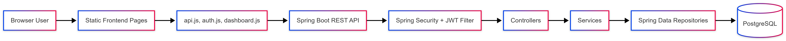
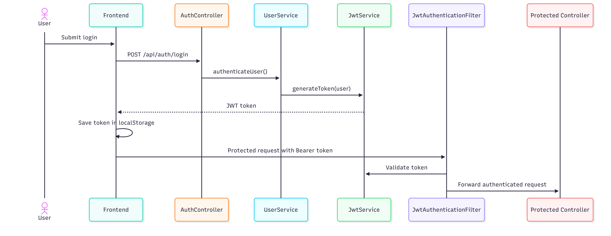
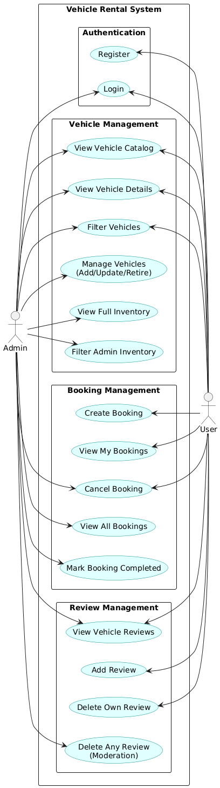
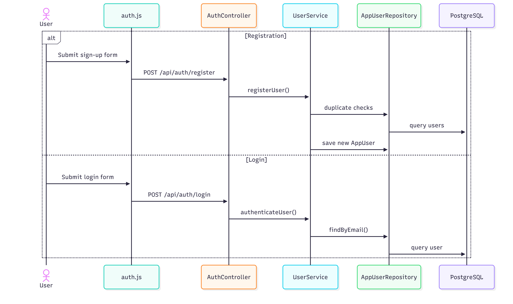
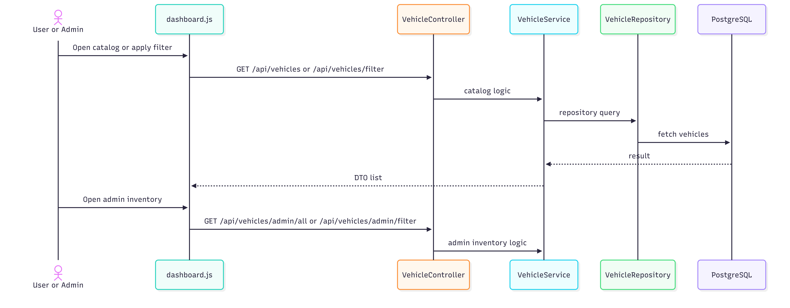
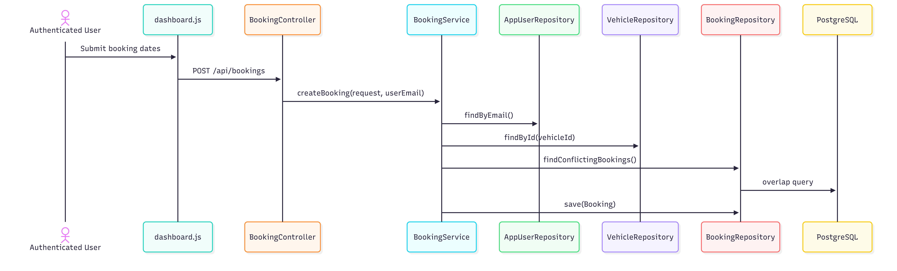
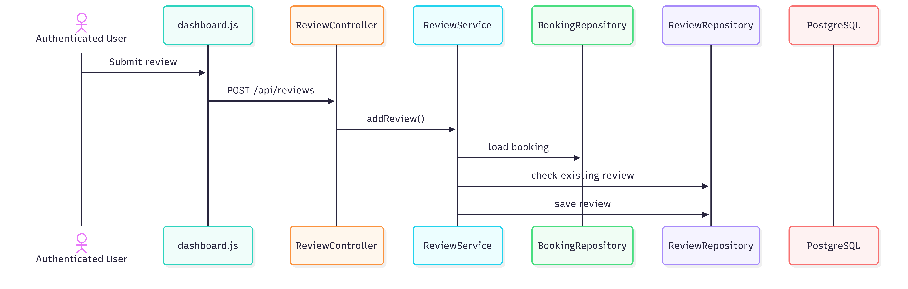

# Vehicle Rental System Architecture

This document explains how `Capstone_VehicleRentalSystem` is structured, how requests move through the system, and how the frontend, backend, and database fit together.

## 1. System Context



At a high level:

- the browser loads static HTML pages from `frontend/`
- JavaScript calls the backend REST API at `http://localhost:8080/api`
- Spring Security validates JWTs for protected routes
- controllers delegate business logic to services
- services use repositories to read and write PostgreSQL data

## 2. Repository-Level Architecture

```text
Capstone_VehicleRentalSystem/
|-- architecture.md
|-- README.md
|-- backend/
|   `-- vehicle-rental-system/
|       |-- src/main/java/com/ashutosh/backend/
|       |   |-- config/
|       |   |-- controller/
|       |   |-- dto/
|       |   |-- entity/
|       |   |-- enums/
|       |   |-- exception/
|       |   |-- repository/
|       |   |-- security/
|       |   `-- service/
|       `-- src/test/java/com/ashutosh/backend/
|-- db/
|   |-- vehicle_rental_schema.sql
|   |-- vehicle_rental_schema.md
|   `-- erd/erd.png
`-- frontend/
    |-- index.html
    |-- register.html
    |-- dashboard.html
    |-- css/
    `-- js/
```

## 3. Backend Layering

The backend follows a standard Spring layered architecture.

### Controllers

Files:

- `AuthController`
- `VehicleController`
- `BookingController`
- `ReviewController`

Responsibilities:

- receive HTTP requests
- validate request DTOs
- extract authentication context where needed
- call the service layer
- return DTO responses

Controllers are intentionally thin.

### Services

Files:

- `UserService`
- `VehicleService`
- `BookingService`
- `ReviewService`

Responsibilities:

- business rules
- validation beyond DTO annotation rules
- workflow orchestration
- status transitions
- mapping persistence entities to response DTOs

This is where the real application logic lives.

### Repositories

Files:

- `AppUserRepository`
- `VehicleRepository`
- `BookingRepository`
- `ReviewRepository`

Responsibilities:

- database access
- Spring Data query methods
- JPQL custom queries for overlap and availability checks

### Entities

Files:

- `AppUser`
- `Vehicle`
- `Booking`
- `Review`

These are JPA-managed persistence models with relations:

- `AppUser -> Booking`: one-to-many
- `Vehicle -> Booking`: one-to-many
- `Booking -> Review`: one-to-one

## 4. Frontend Structure

The frontend is intentionally lightweight and framework-free.

### Pages

- `index.html`: login
- `register.html`: sign-up
- `dashboard.html`: catalog, detail page, bookings, admin inventory actions

### JavaScript Responsibilities

#### `frontend/js/api.js`

- holds the API base URL
- attaches `Authorization: Bearer <token>` when present
- handles `401` session expiry behavior
- validates session with `GET /api/auth/me`

#### `frontend/js/auth.js`

- submits login requests
- submits registration requests
- stores JWT and user info in `localStorage`

#### `frontend/js/dashboard.js`

- loads catalog data
- applies filters
- loads detail view and reviews
- creates bookings
- handles review creation and deletion
- exposes admin inventory actions

## 5. Authentication and Security Model



### Authentication Flow

1. user logs in through `POST /api/auth/login`
2. backend returns a JWT and basic user profile
3. frontend stores token and user metadata in `localStorage`
4. future protected requests send the JWT in the `Authorization` header
5. `JwtAuthenticationFilter` validates the token and builds the Spring Security principal

### Current Security Rules

Configured in `SecurityConfig`.

Important runtime behavior:

- `/api/auth/register` and `/api/auth/login` are public
- `GET /api/vehicles/**` is public
- `GET /api/reviews/vehicle/**` is public
- write routes for vehicles are admin-only
- booking admin routes are admin-only
- all other routes require authentication

### Important Note

The current security configuration also permits:

- `GET /api/vehicles/admin/**`

So the admin vehicle read endpoints are not fully restricted at runtime today, even though they are intended for admin UI use.

## 6. Core Business Flows

## Use Case Diagram



### 6.1 Registration and Login



Key rules:

- email is normalized to lowercase
- duplicate email and duplicate driver's license are rejected
- passwords are stored as BCrypt hashes
- inactive users cannot log in

### 6.2 Vehicle Catalog and Admin Inventory



Key rules:

- public catalog excludes `RETIRED` vehicles
- admin inventory includes retired vehicles
- delete is implemented as status change to `RETIRED`
- date-based availability filtering uses repository query `findAvailableVehiclesByDate(...)`
- admin filter and public filter are intentionally split so retired inventory does not leak into the public catalog

### 6.3 Booking Lifecycle



Key rules:

- end date cannot be before start date
- booking cannot start more than 3 months ahead
- booking length cannot exceed 30 days
- overlapping bookings are rejected
- amount is derived from `dailyRate * days`
- owner or admin may cancel
- active bookings cannot be canceled
- date-based evaluation promotes booking status from `CONFIRMED` to `ACTIVE` to `COMPLETED`

### 6.4 Review Lifecycle



Key rules:

- only the booking owner can create the review
- the booking must already be `COMPLETED`
- one booking can have only one review
- author or admin can delete a review

## 7. Database Architecture

The backend depends on a pre-created PostgreSQL schema.

Configured in:

- `src/main/resources/application.properties`

Important setting:

```properties
spring.jpa.hibernate.ddl-auto=validate
```

That means:

- Hibernate will verify the schema
- Hibernate will not create or update tables automatically

Database artifacts:

- `db/vehicle_rental_schema.sql`
- `db/vehicle_rental_schema.md`
- `db/erd/erd.png`

### Persistence Decisions

- soft delete for vehicles through `RETIRED`
- optimistic locking fields on mutable entities
- auditing through `@CreatedDate` and `@LastModifiedDate`
- booking price snapshot stored in `Booking`
- one review per booking enforced by schema and service logic

## 8. Bootstrapping and Runtime Assumptions

### Application Bootstrap

- `VehicleRentalSystemApplication` enables JPA auditing
- `DataSeeder` inserts a default admin user at startup if absent

Seeded credentials:

- email: `admin@test.com`
- password: `admin123`

### Frontend Runtime Assumptions

- backend runs on `http://localhost:8080`
- API base path is `http://localhost:8080/api`
- token is stored in `localStorage`
- dashboard behavior changes based on `user_role`

## 9. Testing Strategy

The backend test suite includes:

- pure Mockito service tests
- standalone MockMvc controller tests
- Spring Boot application context test

Examples:

- `VehicleServiceTest`
- `BookingServiceTest`
- `ReviewServiceTest`
- `AuthControllerTest`
- `VehicleControllerTest`
- `BookingControllerTest`
- `ReviewControllerTest`

This gives decent coverage across:

- request validation
- service rules
- exception mapping
- controller serialization and HTTP contracts

## 10. Architectural Strengths

- clear separation between controller, service, repository, and frontend layers
- simple frontend deployment model
- business logic is mostly centralized in services
- database schema is explicit and validated
- JWT auth is stateless and fits the SPA-style frontend
- inventory history is preserved through soft deletion

## 11. Current Constraints and Improvement Areas

These are not design blockers, but they are worth knowing:

- admin GET inventory routes are currently permitted by security config
- frontend dashboard stats are not fully synchronized with filtered results
- secrets and local database credentials are still stored in `application.properties`
- frontend is static and framework-free, which keeps it simple but increases manual DOM/state management

## 12. Extension Points

The current design can be extended in these directions without a full rewrite:

- stricter role-based authorization around admin read endpoints
- pagination and sorting for inventory and booking lists
- image upload handling instead of raw image URLs
- audit logging for admin actions
- payment integration before booking confirmation
- notification pipeline for booking lifecycle events
- moving the frontend to React, Angular, or Vue while keeping the backend API intact
